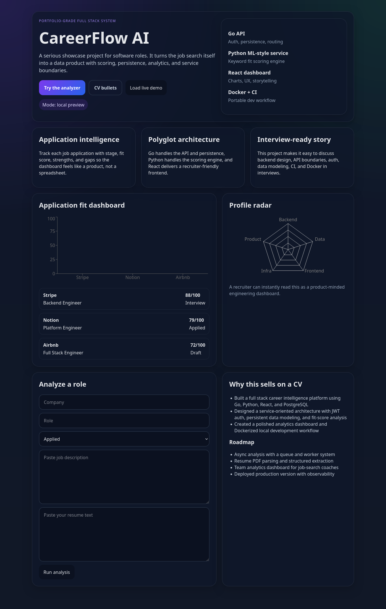

# CareerFlow AI


CareerFlow AI is a full stack job application intelligence platform built to showcase production-minded engineering. It combines a Go backend, a Python analysis service, a React frontend, and PostgreSQL into a polished portfolio project you can demo, discuss in interviews, and feature on GitHub.



## Overview

Most portfolio projects stop at CRUD. CareerFlow AI goes further.

It helps users:
- track job applications across stages
- analyze resume fit against job descriptions
- identify strengths and missing keywords
- view progress in a polished analytics dashboard

It also shows recruiters and hiring managers that you can design across service boundaries, ship a cohesive product, and think beyond basic tutorials.

## Why this project stands out

- **Polyglot architecture**: Go for the API, Python for analysis, React for UX
- **Product-oriented design**: not just backend logic, but a complete user-facing workflow
- **Real engineering concerns**: auth, persistence, service integration, Docker, CI
- **Strong interview story**: easy to discuss tradeoffs, architecture, and future improvements

## Tech Stack

### Frontend
- React
- Vite
- Recharts

### Backend
- Go
- Gin
- JWT authentication
- bcrypt password hashing
- pgx

### Analysis Service
- Python
- FastAPI

### Data + Infrastructure
- PostgreSQL
- Docker Compose
- GitHub Actions

## Features

- User registration and login
- JWT-based authentication
- Application tracking by company, role, and status
- Resume-to-job-description fit scoring
- Strength and gap analysis
- Dashboard visualizations
- Dockerized local development
- CI-ready repository structure

## Architecture

```text
React Frontend
    ↓
Go API (auth, persistence, routing)
    ↓
Python Analysis Service
    ↓
PostgreSQL
```

### Request flow
1. User logs in through the Go backend.
2. User submits a job description and resume.
3. The Go API calls the Python analysis service.
4. The Python service returns a fit score, strengths, gaps, and summary.
5. The Go backend persists the result in PostgreSQL.
6. The frontend renders the updated dashboard.

## Repository Structure

```text
cv-job-tracker/
├── backend-go/              # Go API, auth, persistence, tests
├── python-ml-service/       # FastAPI analysis service
├── frontend/                # React dashboard
├── docs/                    # architecture, deployment, resume snippets
├── scripts/dev.sh           # one-command local startup
└── docker-compose.yml       # full stack orchestration
```

## Getting Started

### Run with Docker

```bash
git clone https://github.com/hackingsage/CV-JOB-TRACKER.git
cd cv-job-tracker
./scripts/dev.sh
```

### Local URLs
- Frontend: `http://localhost:5174`
- Backend: `http://localhost:8081`
- Python service: `http://localhost:8000`
- Postgres: `localhost:5433`

## Demo Credentials

Use the seeded demo account:

- **Email:** `demo@careerflow.dev`
- **Password:** `password123`

## Demo Flow

1. Start the stack with Docker.
2. Open the frontend in your browser.
3. Click **Load live demo**.
4. Paste a job description and resume.
5. Run analysis and watch the result persist into the dashboard.

## API Endpoints

- `POST /api/auth/register`
- `POST /api/auth/login`
- `GET /api/applications`
- `POST /api/applications/analyze`
- `GET /health`

## Resume / CV Description

### One-line version
Built a full stack job application intelligence platform using Go, Python, React, and PostgreSQL, with JWT auth, service-based resume scoring, Dockerized development, and interactive analytics dashboards.

### Bullet version
- Built a polyglot full stack platform using Go, Python, React, and PostgreSQL to track job applications and score resume fit against role requirements.
- Designed service boundaries between a Go API and Python analysis engine, including authentication, persistence, structured scoring output, and dashboard visualizations.
- Implemented Docker-based local development and CI automation to improve portability, consistency, and production-readiness.

## Screenshots

Current asset:
- `docs/media/dashboard.png`

Good additions for the GitHub repo later:
- analyzer screen
- fit score result screen
- architecture diagram

## What I’d Build Next

- async analysis with background jobs and queues
- PDF resume upload and parsing
- full frontend auth state and token persistence
- observability with logs, metrics, and tracing
- public cloud deployment with a live demo URL

## Notes

This project is intentionally designed as a portfolio-quality system, not just a tutorial exercise. It is meant to demonstrate backend depth, system design clarity, and product sense in one repo.

---

If you use this on GitHub, replace `git clone <your-repo-url>` with your actual repository URL after pushing.
